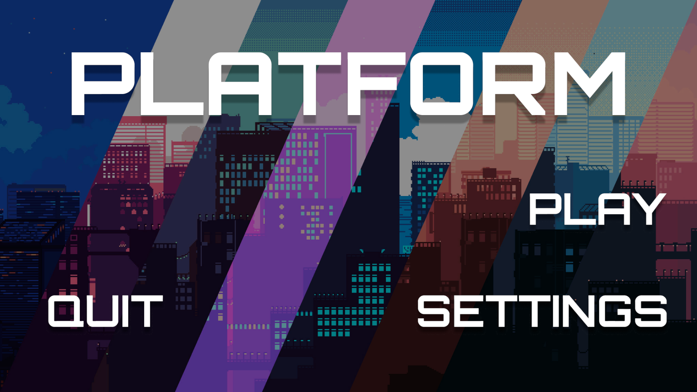
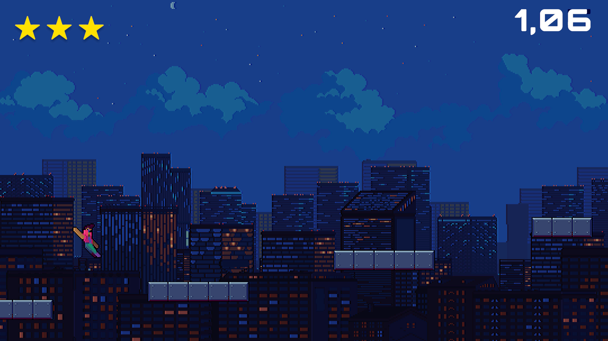

# 🎮 Unity Tabanlı 2D Platform Oyunu  

## 📌 Proje Açıklaması  
Bu proje, **Unity oyun motoru** kullanılarak geliştirilmiş **2D bir platform oyunudur**. Oyuncular, bölümleri en kısa sürede tamamlayarak **30 yıldız toplamak** için mücadele eder. Basit mekanikleri ve **Cyberpunk teması** ile her yaştan oyuncuya hitap eden eğlenceli ve rekabetçi bir deneyim sunar.  

## 🚀 Özellikler  
- 🎮 **Dinamik Oynanış**: Oyuncu ileri, geri ve yukarı hareket ederek platformları aşar.  
- 🌆 **Cyberpunk Atmosferi**: Şehir manzaraları ve futuristik tasarımlar içerir.  
- ⭐ **Rekabetçi Yıldız Sistemi**: Her seviyede tamamlanma süresine göre yıldız kazanılır.  
- 🎨 **Kolay Öğrenilen Mekanikler**: Basit kontrollerle her yaştan oyuncuya hitap eder.  
- 🕹️ **Farklı Seviyeler**: Hareket eden platformlardan düşen engellere kadar çeşitlilikle doludur.  

## 📷 Ekran Görüntüleri  
*Aşağıya oyundan bazı ekran görüntüleri ekleyebilirsiniz.*  

## 🛠 Kullanılan Teknolojiler  
- **Geliştirme Aracı**: Unity Engine  
- **Programlama Dili**: C#  
- **Versiyon Kontrolü**: Git & GitHub 
